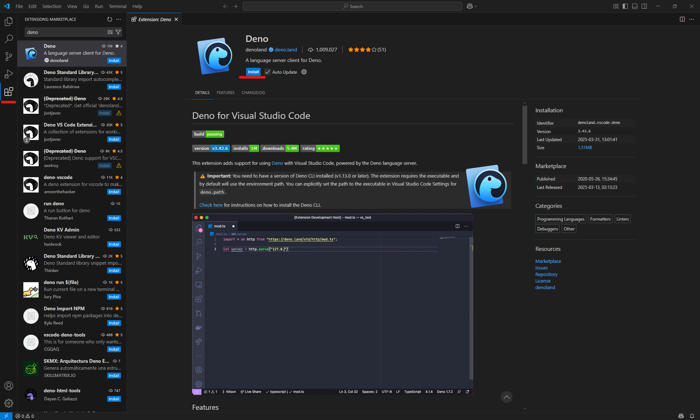
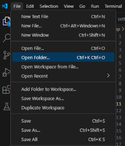
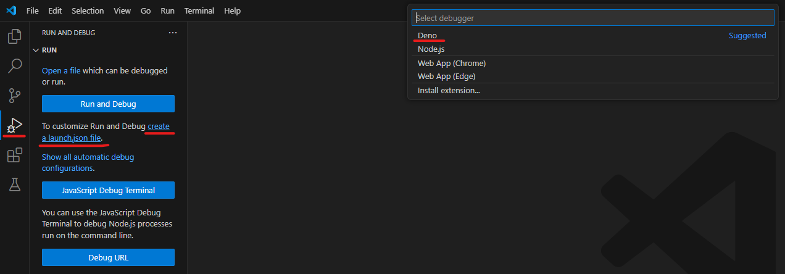
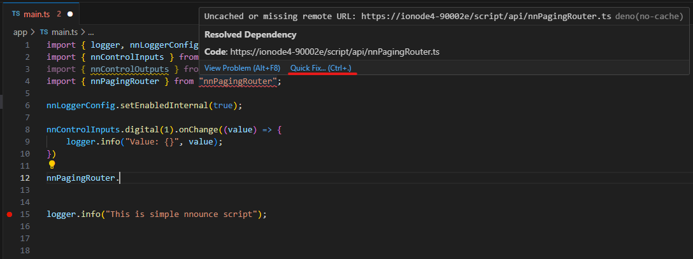
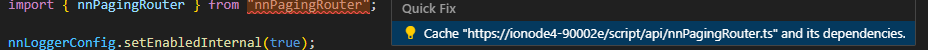

# Tutorial 3: nnounce scripting from Visual Studio Code

1. [Introduction](#introduction)
2. [Setting up Visual Studio Code project](#setting-up-visual-studio-code-project)
3. [Project Structure](#project-structure)
4. [Troubleshooting](#troubleshooting)

## Introduction
Scripting on nnounce devices is available using Deno JavaScript runtime. Scripts are written in TypeScript. Using Visual Studio Code for nnounce scripting enables debugging the scripts.  

All sources are included in the [vsc_project](./vsc_project) folder.

This tutorial was tested with Deno version 2.2.6.

## Setting up Visual Studio Code project
To enable scripting on nnounce devices from Visual Studio Code, follow these steps:
1. Install Deno JavaScript runtime ([https://docs.deno.com/runtime/getting_started/installation/](https://docs.deno.com/runtime/getting_started/installation/))
2. Download and install Visual Studio Code ([https://code.visualstudio.com/download](https://code.visualstudio.com/download))
3. Install Deno extension for VS Code
   1. Go to **Extensions** tab and search for Deno
   2. Install extension  
   
4. Create folder for your scripting project and open it in VS Code  
   
5. Create the `.vscode/launch.json` file  or use tab **Run and Debug**  
   
   Paste the configuration into `launch.json`, replacing placeholders in angle brackets as needed:
```json
{
    // Use IntelliSense to learn about possible attributes.
    // Hover to view descriptions of existing attributes.
    // For more information, visit: https://go.microsoft.com/fwlink/?linkid=830387
    "version": "0.2.0",
    "configurations": [
        {
            "request": "launch",
            "name": "Launch Program",
            "type": "node",
            "program": "${workspaceFolder}/app/main.ts",
            "cwd": "${workspaceFolder}",
            "runtimeExecutable": "<path to deno.exe>",
            "runtimeArgs": [
                "run",
                "--import-map",
                "./app/import_map.json",
                "--inspect-wait",
                "--allow-env",
                "--allow-net",
                "--unsafely-ignore-certificate-errors",
                "--allow-import"
            ],
            "attachSimplePort": 9229,
            "env": {
                "HOSTNAME": "<hostname>",
                "PORT": "443",
                "API-KEY": "<api-key>"
            }
        }
    ]
}
```
Configuration parameters explained:
- `program`: path to main file which is executed during run
- `runtimeExecutable`: path to deno.exe file
- `runtimeArgs`: arguments passed to Deno executable 
  - `-import-map`: path to import map file
  - `-inspect-wait`: waits for a debugger (V8 Inspector Protocol) to connect before executing your code
  - `-allow-env`: allows access to environment variables
  - `-allow-net`: grants network access permission
  - `-reload`: forces a fresh download of sources before execution
  - `--unsafely-ignore-certificate-errors`: ignore certificate errors (nnounce devices use self-signed certificates)
  - `--allow-import`: allows import from non-"public good" registries
- `attachSimplePort`: specifies the debugging port
- `env`: environment variables for the program
  - `HOSTNAME`: hostname or URL of the nnounce device where script will be run
  - `PORT`: port on which the nnounce server runs
  - `API-KEY`: api key of user used for sending requests from script to nnounce device
6. Create the `.vscode/settings.json` file
```json
{
     "deno.enable": true,
     "deno.importMap": "./app/import_map.json"
}
```
7. Create the `app/import_map.json` file. Replace placeholders in angle brackets with hostname or IP address of your nnounce device.
```json
{
    "imports": {
        "nnPagingRouter" : "https://<hostname or ip>/script/api/nnPagingRouter.ts",
        "nnControlInputs": "https://<hostname or ip>/script/api/nnControlInputs.ts",
        "nnControlOutputs": "https://<hostname or ip>/script/api/nnControlOutputs.ts",
        "nnDsp": "https://<hostname or ip>/script/api/nnDsp.ts",
        "loggerUtil": "https://<hostname or ip>/script/api/utils/LoggerUtil.ts",     
        "nnSnmp": "https://<hostname or ip>/script/api/nnSnmp.ts",
        "nnSystem": "https://<hostname or ip>/script/api/nnSystem.ts",
        "nnUtil": "https://<hostname or ip>/script/api/utils/NnUtil.ts",
        "initialization": "https://<hostname or ip>/script/api/initialization/ApiInitializer.ts"
    }
}
```
8. Create the `app/main.ts` file
```typescript
import { initializeNnounceApi } from "initialization";
(async () => {
    await initializeNnounceApi ();
    await import("./script.ts");
})();
```
9. Create the `app/script.ts` file
```typescript
setInterval(() => {
    console.log("nnounce just works");
}, 5000);
```
10. Run the application by pressing F5 or navigate to **Run -> Start Debugging**

## Project structure
Your project directory should look like this:
```
.vscode/
 ├── launch.json
 ├── settings.json
app/
 ├── import_map.json
 ├── main.ts
 ├── script.ts
```

## Troubleshooting
If VS Code highlights imports from `import_map.json` as errors before first run, try these solutions:
1. **Quick Fix**: Hover over the error, click **Quick Fix** and **Cache "\<import\>" and its dependencies.**  
  

2. **Run the Application**: If IDE does not present Quick Fix option, try running the application. This should either resolve the issue or enable the Quick Fix option.

---

This tutorial covered setup of nnounce scripting from Visual Studio Code. Happy coding!