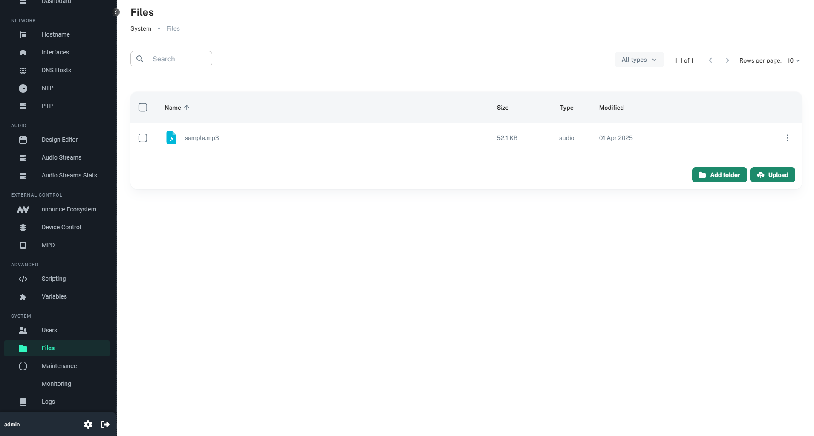
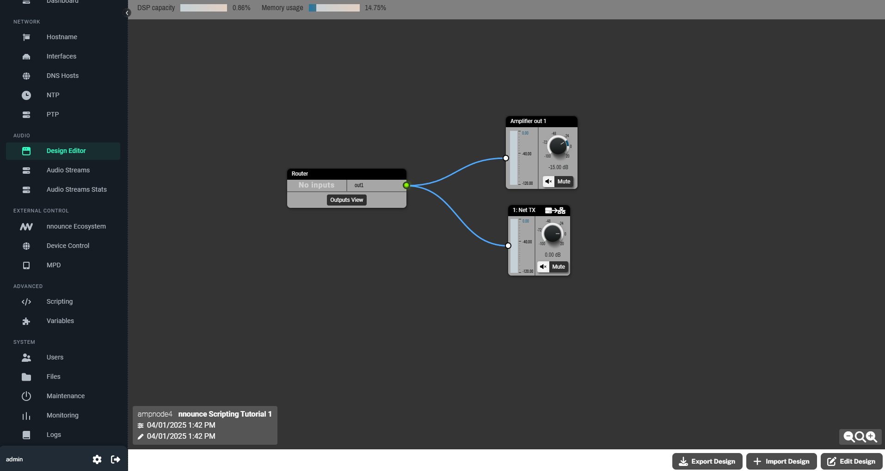
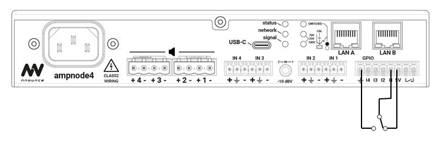
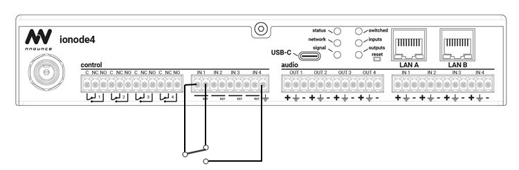

# Tutorial 1: Play local file when an input pin is set high (on cooldown)

1. [Introduction](#introduction)
2. [Before you start](#before-you-start)
3. [Uploading file to device](#uploading-file-to-device)
4. [Creating and deploying a design](#creating-and-deploying-a-design)
5. [Writing the script](#writing-the-script)
6. [Triggering the input](#triggering-the-input)


## Introduction
Some nnounce devices have control inputs, outputs or configurable GPIO pins (e.g. `ampnode4`, `ionode4`, `micnode2g` and `micnode2h`). 
You can utilize these via scripting to perform actions based on their states.  

This tutorial primarily targets `ampnode4` and `ionode4`, using input pin 1 as a trigger to execute script-defined action.

Most control inputs can be used in two modes - analog or digital. 
More details are available in the nnounce scripting documentation through the nnounce web UI.
Further scripting information can be found in the nnounce configuration guide at [https://docs.simpleway.cloud/nnounce/docs/scripting](https://docs.simpleway.cloud/nnounce/docs/scripting).

In this tutorial, we will use input pin 1 in digital mode. When set high, the device will play a local file (stored on the device). 
A cooldown period will ensure the file plays at most once every 60 seconds.

To achieve this, we need to go through several steps:
1. Upload a file to the nnounce device
2. Create and deploy a design
3. Write a script to play uploaded file with cooldown logic
4. Trigger the script by setting input pin high

## Before you start
Ensure that you:
- have an audio file in .mp3, .flac or .wav format
- have an nnounce device connected, running and reachable from your computer
- have a method to trigger the input pin

> Note: All steps of this tutorial assume you are logged in to the device.

## Uploading file to device
1. Navigate to **Files** tab
2. Click **Upload** button
3. Select your file and upload it

You should now see your file listed on **Files** tab.


More on file management can be found in nnounce configuration guide at [https://docs.simpleway.cloud/nnounce/docs/file-manager](https://docs.simpleway.cloud/nnounce/docs/file-manager).

## Creating and deploying a design
To play a local file, we need some minimal design running in the device. 
We need Router component and some output – either Analog Out or Net Tx component (or both). 

1. Navigate to **Design Editor** tab
2. Click **Edit design** button if there is already some design running
3. Add Router component from I/O menu
4. Add Router Output and name it `out1`. You can name it however you want, just make sure you then use the correct name in script.
5. Add some Analog/Amplifier output (based on nnounce device used) and/or Net TX component
6. Connect Router output `out1` to the output component
7. Click **Deploy Design** button

The resulting design should look like this:


To hear the file being played and based on whether you used Analog Output or Net Tx component (or both) in design, you need to connect some speakers or to set up a stream somewhere you will be able to listen to it.

More on Design Editor can be found in nnounce configuration guide at [https://docs.simpleway.cloud/nnounce/docs/designer-dsp-configuration](https://docs.simpleway.cloud/nnounce/docs/designer-dsp-configuration).

More on setting up streams can be found in nnounce configuration guide at [https://docs.simpleway.cloud/nnounce/docs/audio-streams](https://docs.simpleway.cloud/nnounce/docs/audio-streams).

## Writing the script
Now that we have our file uploaded and design deployed, it is time to write the background script that will play our file into the output when triggered. 

You can use the following script:
```javascript
// import modules we will need
import { nnControlInputs } from "nnControlInputs"; // lets us react to control input value change
import { nnPagingRouter } from "nnPagingRouter"; // lets us play local file

// let the user know the script started
console.log("Starting tutorial script 1");

let playbackAvailable = true; // playback available flag

nnControlInputs.digital(1) // use the pin 1 in digital mode, pins are numbered from 1
    .onChange((val) => {  // define function handling change of input value
        console.log(`Change on digital input 1 - current value: ${val}`); // log current input pin value
        if (val) { // if pin is high (means val is true)...
			if (!playbackAvailable) {  // if our playback is on cooldown, log it and return
				console.log("Playback not available yet");
				return;
			}
            nnPagingRouter.playLocalFile(  // cooldown ready, proceed to play local file
                {
                    priority: 2,  // with priority 2 (the lower the number, the higher the priority)
                    audioFilePath: "sample.mp3", // path to file we want to play
                    outputs: ["out1"]   // list of router outputs we want the file be played to 
                }
            );
            console.log(`Playing local file test.mp3`); // let the user know the file is playing
			playbackAvailable = false;  // set our playback avaialable flag to false...
			setTimeout( // ...and start our cooldown, which will make the playback available in one minute
					() => {
						console.log("Playback available");
						playbackAvailable = true;
					},
					60000,
			);
        }
    });
```
More on how to write scripts can be found in nnounce configuration guide at [https://docs.simpleway.cloud/nnounce/docs/scripting](https://docs.simpleway.cloud/nnounce/docs/scripting).

## Triggering the input

Provided are schemas for ampnode4 and ionode4.

  
More on ampnode4 features can be found in nnounce installation guide at [https://docs.simpleway.cloud/nnounce/docs/features-ampnode4](https://docs.simpleway.cloud/nnounce/docs/features-ampnode4).

  
More on ionode4 features can be found in nnounce installation guide at [https://docs.simpleway.cloud/nnounce/docs/features-ionode4](https://docs.simpleway.cloud/nnounce/docs/features-ionode4).

More on other products can be found on nnounce website at [https://www.nnounce.com/](https://www.nnounce.com/), or in installation guides at [https://docs.simpleway.cloud/nnounce/docs/installation-guides](https://docs.simpleway.cloud/nnounce/docs/installation-guides). 